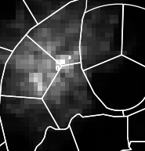

# Examples
Examples are meant to illustrate main usage scenarios for `rastertools` API functions.  

Before running any of the examples install the `rastertools` package as described in the `Setup` steps in the main [README](../README.md)  

## Extracting Population from WorldPop 
This example shows how to use `raster_clip` function to extract population data from WorldPop raster files based on shapes.  

  

To run the example execute:
```bash
`python worldpop_clipping.py
```


The example will generate a dictionary mapping shape names to summarized population:  
  
  

The `raster_clip` function also supports the `weighted raster clipping` scenario.  
You can see an example of this in [tests/test_raster.py](../tests/test_raster.py), in test `test_raster_clip_weighted`.  
The output in this case looks like this:  
   

To generate EMOD Demographics use emdo_api to generate EMOD demographics from extracted pop data.  
You can see the code for this in [tests/test_scenarios.py](../tests/test_scenarios.py), test "test_emod_demographics".

## Creating Subdivision Layer
This example shows how to use the `shape_subdivide` function to create a subdivision layer.

To run this example execute:`

```bash
`python worldpop_clipping.py  
```
The example will generate subdivision shapes (Voronoi polygons) and their visualization (see `results/COD_LEV02_ZONES_100km.png` image).  

To explore subdivision shapes you can also use QGIS:  

